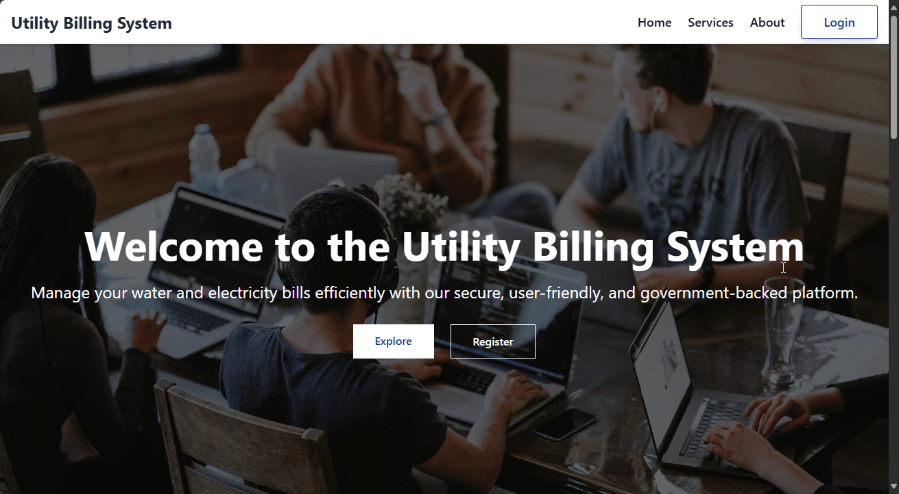
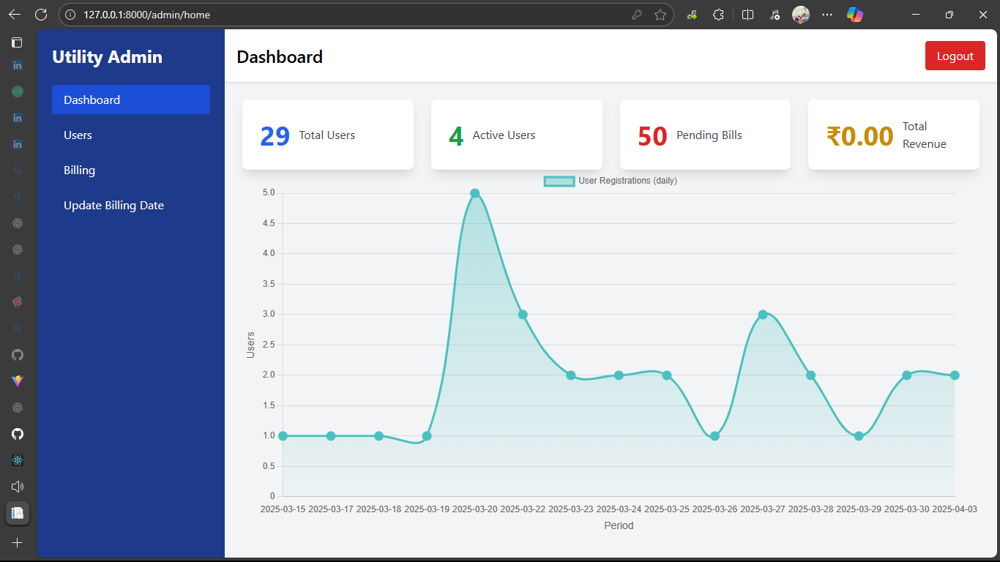
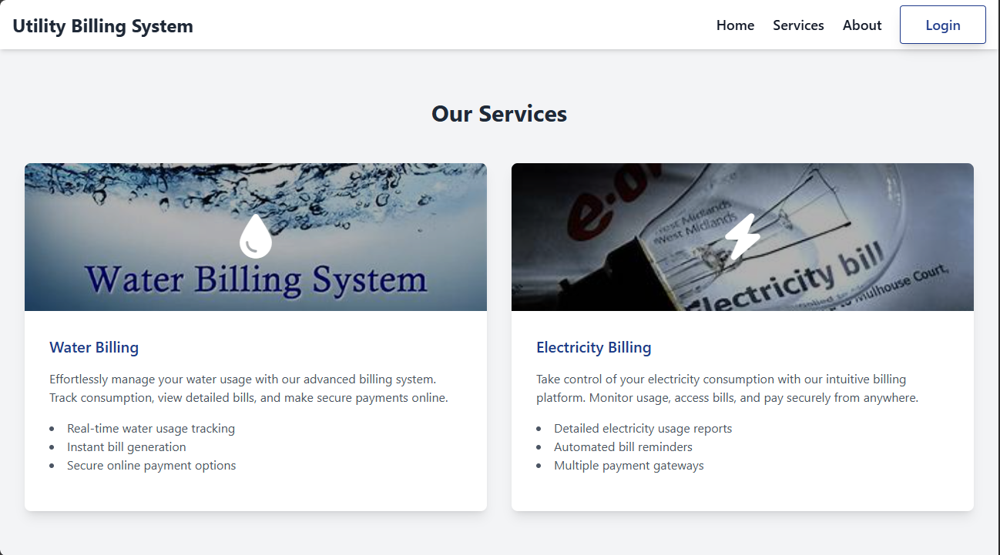
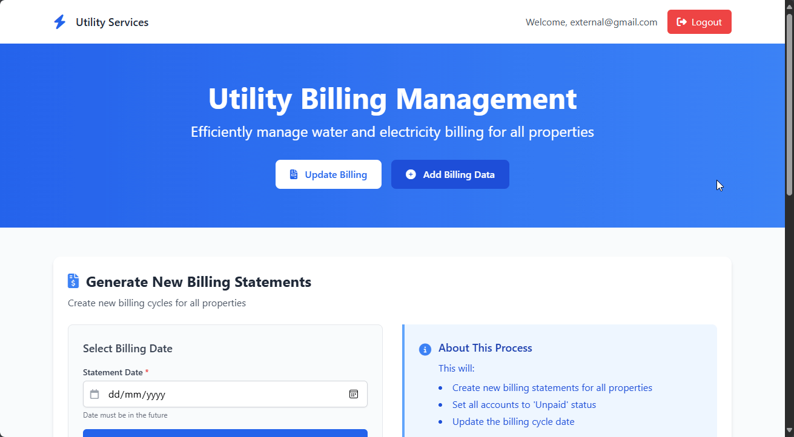

# Utility Billing Management System

A comprehensive utility billing management platform with three distinct modules: Admin, User, and External portal.



## 🚀 Features

### 1. Admin Module

- **Dashboard**: Real-time analytics and statistics
- **User Management**: View and manage user accounts
- **Billing Management**: Update billing dates and monitor payments
- **Email Notifications**: Send automated reminders for unpaid bills
- **Report Generation**: Create detailed billing and payment reports

### 2. User Module

- **Bill Status**: Check water and electricity bill status
- **Online Payments**: Secure payment processing via Razorpay
- **Payment History**: View past transactions and download receipts
- **Profile Management**: Update personal information

### 3. External Module

- **Public Access**: View bills without registration
- **Quick Pay**: One-time payment option
- **Bill Verification**: Verify bill authenticity

## 🛠️ Installation

### Prerequisites
- Python 3.8+ (recommended: Python 3.10.11)
- PostgreSQL
- FastAPI

### Setup Steps

1. **Clone the Repository**
   ```bash
   git clone https://github.com/yourusername/utility-billing-system.git
   cd utility-billing-system
   ```

2. **Install Dependencies**
   ```bash
   pip install -r requirements.txt
   ```

3. **Environment Configuration**
   Create a `.env` file in the root directory:
   ```properties
   # Razorpay Configuration
   RAZORPAY_KEY_ID=#Add Razorpay key
   RAZORPAY_KEY_SECRET=#ADD RazorPay Secret

   # Database Configuration
   DB_PASSWORD=#DB Password
   DB_HOST=#Host Type
   DB_PORT=#Port Number
   NEW_DB="Utility"
   DB_USER="postgres"

   # Email Configuration
   sender_email="your-email@gmail.com"
   sender_password="your-app-password"
   ```

4. **Start the Application**
   ```bash
   uvicorn main:app --reload
   ```
   The application will be available at `http://127.0.0.1:8000`

> **Note**: The database will be automatically created when you first run the application.

## 🔑 Default Credentials

### Admin Portal
```
URL: http://127.0.0.1:8000/admin
Email: admin@gmail.com
Password: 123456
```

### User Portal
```
URL: http://127.0.0.1:8000
Email: user@gmail.com
Password: 123456
```

### External Portal
```
URL: http://127.0.0.1:8000/external
Email: external@gmail.com
Password: 123456
```

## 📁 Project Structure
```
utility-billing-system/
├── templates/
│   ├── admin/         # Admin portal templates
│   ├── users/         # User portal templates
│   └── external/      # External portal templates
├── static/
│   └── images/        # Image assets
├── main.py           # Application entry point
├── database.py       # Database operations
├── payment.py        # Payment processing
└── route.py          # URL routing
```

## 📫 Contact & Support

For support or queries:
- **Email**: crazyscriptright@gmail.com
- **GitHub**: [Utility Billing System](https://github.com/crazyscriptright/utility-billing-system)

## 📄 License

This project is licensed under the MIT License. See the LICENSE file for details.
